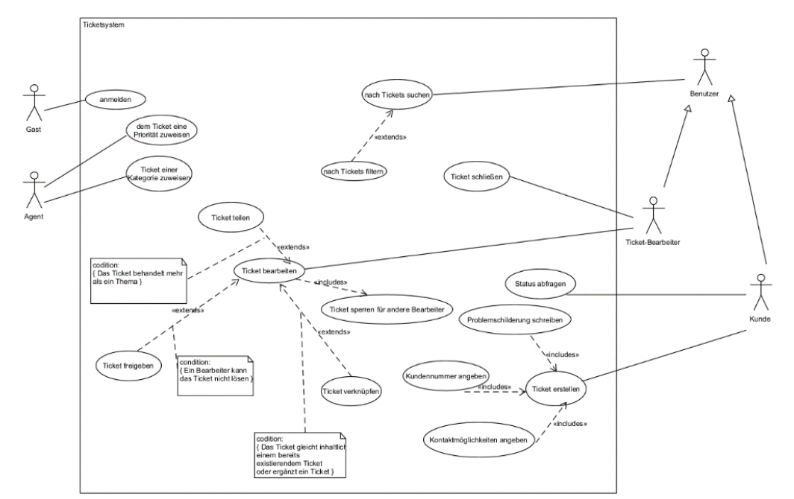

#  Ticket-System (SWE1-Projekt)

Ticketsystem zur Bearbeitung und Verwaltung von Support-Anfragen.
Dies ist das Semesterprojekt unseres Teams im Modul **Software Engineering I** an der Hochschule Bremerhaven. Ziel war es, ein einfaches, modellbasiertes **Ticket-System** zu entwerfen und als funktionsfähigen Prototyp umzusetzen.

## Projektüberblick

- **Thema:** Issue-Tracking-System (Ticketsystem)
- **Modellierung:** UML (Use-Case-, Klassendiagramm, Aktivitäts- und Zustandsdiagramme)
- **Prototyp:** HTML + Bash-Skripte (keine vollständige Webanwendung)
- **Rollen:** Gast, Kunde, Agent, Ticketbearbeiter
- **Funktionen:** Ticket erstellen, bearbeiten, sperren, schließen, kategorisieren, priorisieren

**Use-Case-Diagramm**

 

## Tech-Stack

- UML-Modellierung mit **UMLet**
- Prototyping mit **HTML**, **Bash**
- Wireframing mit **Balsamiq**

## Features

- Authentifizierter Login
- Dynamische Ticketbearbeitung mit Statuswechsel
- Übersicht über alle Tickets inkl. Filterfunktionen
- Einfache Benutzeroberfläche (GUI-Prototyp)

*Hinweis:* Dieses Projekt ist ein Lernprojekt im Rahmen eines Studienmoduls und nicht für den produktiven Einsatz gedacht.
